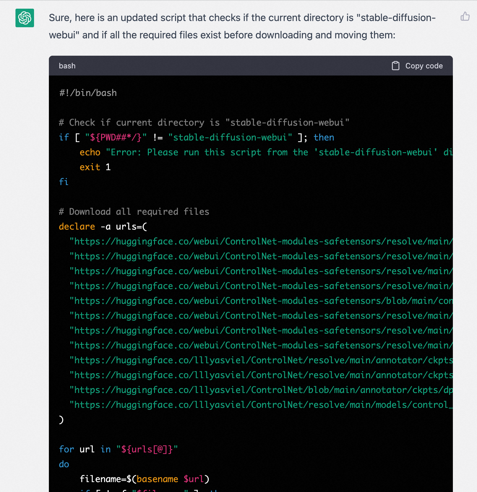
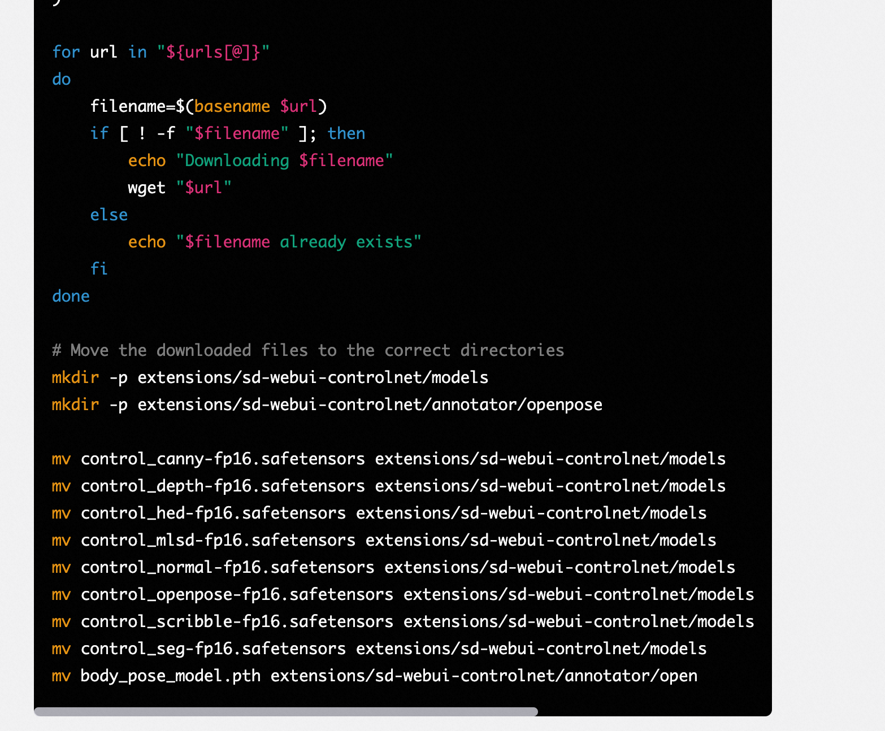
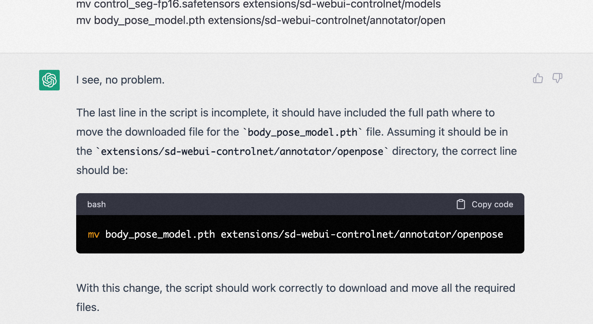

# sd-webui-auto-install-controlnet
This project is written by Chatgpt, I just show you how to correct prompt it, and verify the answer.

the aim of this project how can I use gpt to help my work, the
script on of install_control_net.sh is working good on Linux/MacOS.

On Windows is not verify, maybe you can do it for me.

